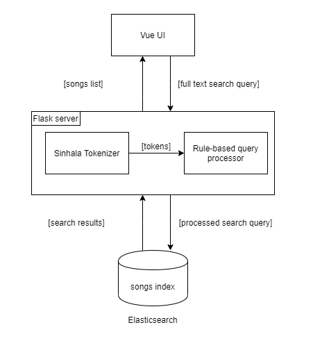

# Sinhala Songs Search Engine

Sinhala Songs Search Search Engine is an elasticsearch based web application with a Python Flask backend. The included corpus contains details of more than 1000 Sinhala songs. Also, this application provides search-as-you-type functionality with a minimal clean UI implemented with Vue. Users can search

1. for lyrics and
2. based on popularity index in Sinhala

and for the following metadata in both Sinhala and English languages.

3. Title
4. Artist
5. Writer
6. Composer
7. Genre

## Architecture



## Folder Structure

```
.
+-- corpus
|   +-- index_id_add.ipynb - jupyter notebook for adding a id for each song document
|   +-- processed.json - processed songs corpus
|   +-- raw.csv - raw songs corpus immediately after scraping
|   +-- translator.ipynb - jupyter notebook for translating english metadata to sinhala
+-- es
|   +-- settings.json - settings and mappings for songs index
+-- images
|   +-- architecture.png - architecture diagram
+-- scraping - scrapy project for scraping SinhalaSongBook website
+-- search-application - Flask application with UI templates
```

## Dataset

The sinhala songs corpus is created by scraping [SinhalaSongBook](https://sinhalasongbook.com/) website using scrapy web scraping tool.

## Getting Started

These instructions will get you a copy of the project up and running on your local machine for development and testing purposes.

### Prerequisites

The following softwares/libraries should be installed in your system properly, prior to setting up and running the application on a local or a live environment.

- [Elasticsearch 7.8](https://www.elastic.co/guide/en/elasticsearch/reference/7.8/index.html) - Analytical Engine
- [Sinling](https://github.com/ysenarath/sinling) - Sinhala language tokenizer

### Installing

A step by step series of examples that tell you how to get a development env running.

#### Setup Elasticsearch

1. Install and get elasticsearch server up and running.

2. Install [ICU Analysis](https://www.elastic.co/guide/en/elasticsearch/plugins/current/analysis-icu.html) plugin.

3. Optionally you can install [Kibana](https://www.elastic.co/downloads/kibana) for query operations.

4. Setup 'songs' index in elasticsearch using `settings.json` in `es` folder as the body.

```
PUT <elsticsearch-host: port>/songs
{
  "settings": {
    "index": {
      "number_of_shards": 1,
      "number_of_replicas": 1
    },
    "analysis": {
      "analyzer": {
        "names-analyser-si": {
          "type": "custom",
          "tokenizer": "icu_tokenizer",
          "char_filter": ["punctuation_char_filter"],
          "filter": ["edge_n_gram_filter"]
        },
        "lyrics-analyser-si": {
          "type": "custom",
          "tokenizer": "icu_tokenizer"
        },
        "english-analyzer": {
          "type": "custom",
          "tokenizer": "classic",
          "char_filter": ["punctuation_char_filter"],
          "filter": ["edge_n_gram_filter", "lowercase"]
        },
        "names-search-analyser-si": {
          "type": "custom",
          "tokenizer": "icu_tokenizer",
          "char_filter": ["punctuation_char_filter"],
          "filter": ["sinhala_stop_filter"]
        },
        "english-search-analyzer": {
          "type": "custom",
          "tokenizer": "classic",
          "char_filter": ["punctuation_char_filter"],
          "filter": ["lowercase", "stop"]
        }
      },
      "char_filter": {
        "punctuation_char_filter": {
          "type": "mapping",
          "mappings": [
            ".=>\\u0020",
            "|=>",
            "-=>",
            "_=>",
            "'=>",
            "/=>",
            ",=>\\u0020"
          ]
        }
      },
      "filter": {
        "edge_n_gram_filter": {
          "type": "edge_ngram",
          "min_gram": "2",
          "max_gram": "10"
        },
        "sinhala_stop_filter": {
          "type": "stop",
          "stopwords": [
            "සහ",
            "හා",
            "වැනි",
            "සේ",
            "‌මෙන්",
            "සමග",
            "කල",
            "කළ",
            "කරපු",
            "කරන",
            "ඇති",
            "ලද",
            "ඇත",
            "කරන",
            "කළා"
          ]
        }
      }
    }
  },
  "mappings": {
    "properties": {
      "song_id": {
        "type": "integer"
      },
      "titile_en": {
        "type": "text",
        "analyzer": "english-analyzer",
        "search_analyzer": "english-search-analyzer"
      },
      "title_si": {
        "type": "text",
        "analyzer": "names-analyser-si",
        "search_analyzer": "names-search-analyser-si"
      },
      "artist": {
        "type": "text",
        "analyzer": "english-analyzer",
        "search_analyzer": "english-search-analyzer",
        "fields": {
          "keyword": {
            "type": "keyword"
          }
        }
      },
      "artist_si": {
        "type": "text",
        "analyzer": "names-analyser-si",
        "search_analyzer": "names-search-analyser-si"
      },
      "genre": {
        "type": "text",
        "analyzer": "english-analyzer",
        "search_analyzer": "english-search-analyzer",
        "fields": {
          "keyword": {
            "type": "keyword"
          }
        }
      },
      "genre_si": {
        "type": "text",
        "analyzer": "names-analyser-si",
        "search_analyzer": "names-search-analyser-si"
      },
      "writer": {
        "type": "text",
        "analyzer": "english-analyzer",
        "search_analyzer": "english-search-analyzer"
      },
      "composer": {
        "type": "text",
        "analyzer": "english-analyzer",
        "search_analyzer": "english-search-analyzer",
        "fields": {
          "keyword": {
            "type": "keyword"
          }
        }
      },
      "composer_si": {
        "type": "text",
        "analyzer": "names-analyser-si",
        "search_analyzer": "names-search-analyser-si"
      },
      "rating": {
        "type": "integer",
        "index": false
      },
      "lyrics": {
        "type": "text",
        "analyzer": "lyrics-analyser-si"
      }
    }
  }
}
```

#### Setup Flask project

1. Install `pip` dependencies and start python server by running the following command in the root directory of the project

```
cd ./search-application
pip install -r requirements.txt
python ./app.py
```

2. Insert data into the `songs` index by sending a `POST` request to `insert_data` endpoint of the python server [You may need check the path of processed corpus in ```app.py``` with related to current directory of ther terminal if current directory is different from the above step]

```
POST http:\\localhost:5000\insert_data
```

3. Navigate to `http:\\localhost:5000` to view the search application interface

4. Hover over search icon and the search bar will appear. This application provides full-text search functionalities for queries such as follows.

   1. Search can be done for any of the above listed metadata values by directly entering search values into the search bar or using full text queries

   ```
    අමා රන් පැය, අමා රන් පැය ගීතය, වික්ටර් රත්නායක, වික්ටර් රත්නායක ගැයූ ගීත, කරුණාරත්න අබේසේකර ලියූ ගීත, සුනිල් එඩිරිසිංහ සංගීතවත් කල ගීත
   ```

   2. Search for popular songs by including Sinhala key words such as `ජනප්‍රියම`, `ප්‍රසිද්ධ`, `හොඳම` and several others.

   ```
   ජනප්‍රිය ගීත, හොඳම ගීත, සුපිරි ගීත
   ```

   3. By default the above query will return 10 most popular songs. The songs count can be set by including a number into the query.

   ```
   ජනප්‍රියම ගීත 5, ප්‍රසිද්ධම ගීත 20
   ```

   4. The above mentioned popular queries can be combined with queries for metadata.

   ```
   වික්ටර රත්නායක ගැයූ හොඳම ගීත, වික්ටර රත්නායක ගැයූ හොඳම ගීත 5, සුනිල් එඩිරිසිංහ ලියූ ජනප්‍රියම ගීත 20
   ```

   5. All the alowed combinations of words can be found in the `app.py` file in the list variables.

## Authors

- **Harith Sankalpa** - _Initial work_ - [GithubProfile](https://github.com/harith96)

## License

This project is licensed under the MIT License - see the [LICENSE.md](LICENSE.md) file for details

## Acknowledgments

- Hat tip to [Mr Yasas Senevirathana](https://github.com/ysenarath/) for developing such good Sinhala Analytical Tool: [Sinling](https://github.com/ysenarath/sinling)
